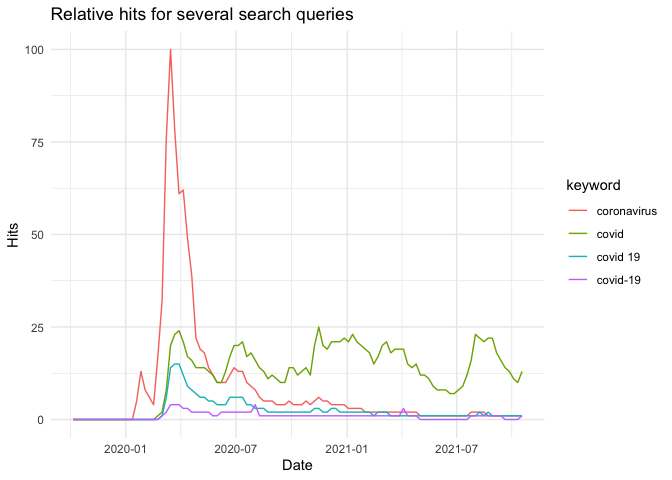
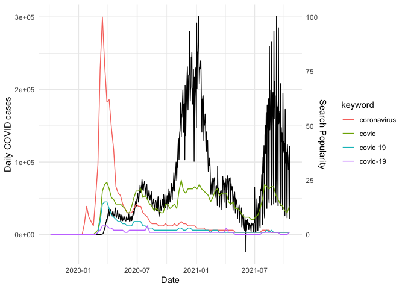
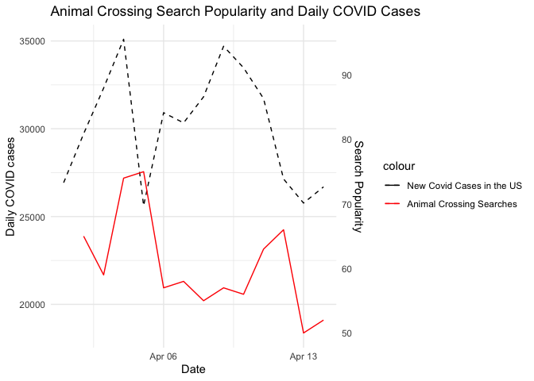
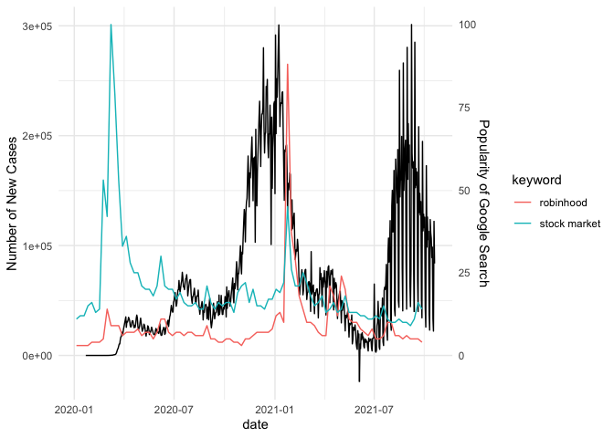
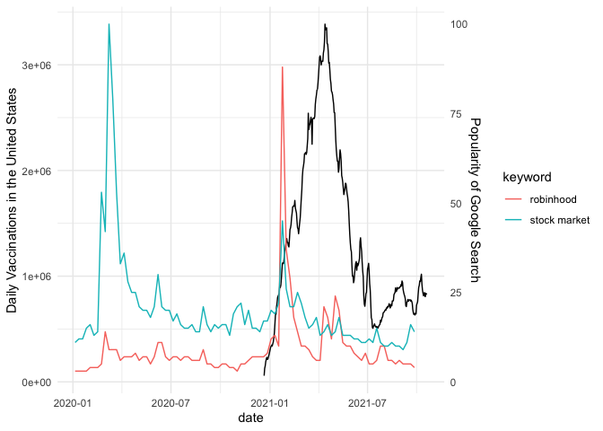
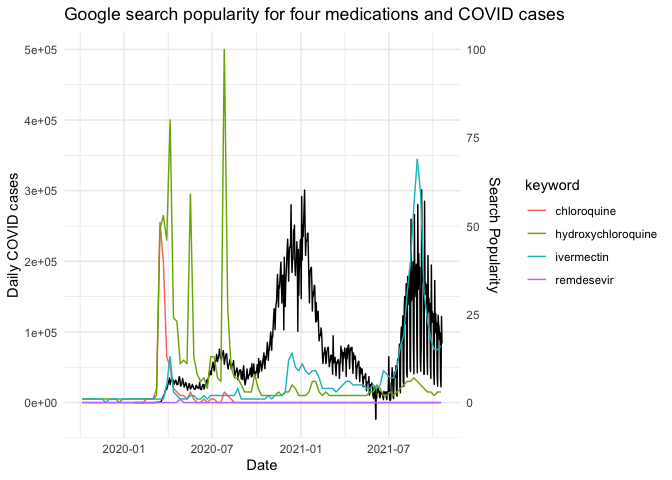
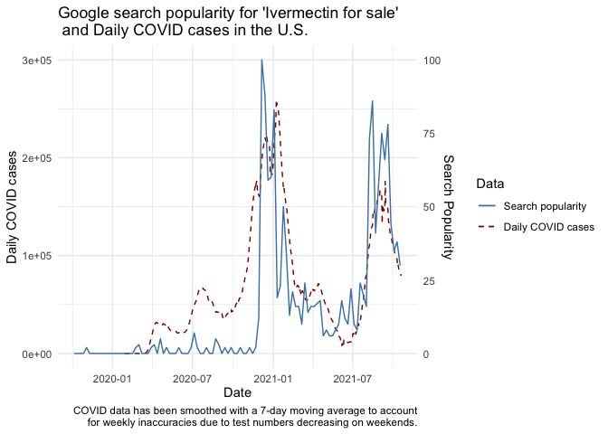
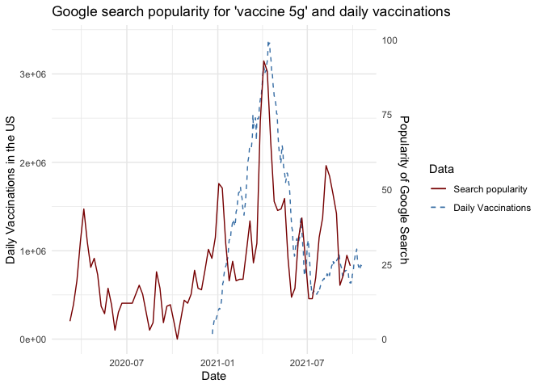
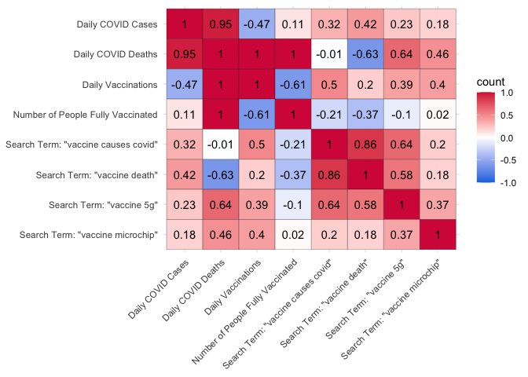

Project Report
================
Team Gamma
2021-10-20

-   [Google Trends and the Pandemic](#google-trends-and-the-pandemic)
    -   [Authors: Megan, Colin, Claire, Meagan,
        Akoua](#authors-megan-colin-claire-meagan-akoua)
    -   [Introduction](#introduction)
    -   [Data](#data)
        -   [Google Trends](#google-trends)
        -   [New York Times COVID-19 cases and deaths and the Census
            Bureau](#new-york-times-covid-19-cases-and-deaths-and-the-census-bureau)
        -   [Our World in Data vaccination
            rates](#our-world-in-data-vaccination-rates)
    -   [Exploratory Data Analysis](#exploratory-data-analysis)
        -   [NYT COVID-19 cases and deaths and Census
            Data](#nyt-covid-19-cases-and-deaths-and-census-data)
        -   [Vaccination data](#vaccination-data)
        -   [Google Trends data](#google-trends-data)
    -   [Time series analysis](#time-series-analysis)
        -   [Start of pandemic graphs](#start-of-pandemic-graphs)
        -   [Financial decisions during the
            pandemic](#financial-decisions-during-the-pandemic)
        -   [Misinfomation graphs](#misinfomation-graphs)
    -   [Abstracting away from time
        series](#abstracting-away-from-time-series)
        -   [Correlation graphs](#correlation-graphs)
    -   [Remaining Questions](#remaining-questions)

# Google Trends and the Pandemic

### Authors: Megan, Colin, Claire, Meagan, Akoua

## Introduction

In this project, our team set out to explore relationships between
Google search trends and the state of the COVID-19 pandemic. Our central
question was the following: “How does Google search activity correlate
with the pandemic?”

## Data

### Google Trends

[Google Trends](https://trends.google.com/trends/?geo=US) \[1\] provides
Google search data, showing a measure of interest in a keyword or topic
over time. Google Trends anonymizes, categorizes, and groups together
data, from which we can access a representative sample. Google Trends
also normalizes search data by dividing each data point by total
searches in the location and time period selected and scaling the result
between zero and 100.

We pulled data from Google Trends to explore how search terms might
reflect underlying behaviors within the US population during the
pandemic.

To access Google Trends data without having to manually download `.csv`
files for each query, we used the R package
[`gtrendsR`](https://cran.r-project.org/web/packages/gtrendsR/gtrendsR.pdf)
which scrapes the Google Trends site and returns data in a list of R
dataframes. We used `gtrends()` with different parameters for search
keyword, time, and geographical location.

### New York Times COVID-19 cases and deaths and the Census Bureau

The New York Times (NYT) has been collecting and publishing COVID case
and death data since the first recorded case back in January 2020. The
dataset is collected from local and state governments and health
departments in the Times’ attempt to create a fuller picture of the
pandemic. Data is reported by county and state and is publicly available
via [GitHub](https://github.com/nytimes/covid-19-data).

We pair the above COVID case and death data with population data from
the [Census Bureau](https://www.census.gov/data.html), and follow the
steps provided in `c06`. The population data can be found
[here](https://data.census.gov/cedsci/table?q=United%20States&t=Population%20Total&g=0100000US%240500000&tid=ACSDT1Y2017.B01003&vintage=2017&layer=state&cid=DP05_0001E).

### Our World in Data vaccination rates

To look at vaccination rates, we used the Our World in Data (OWID)
vaccinations dataset, found on their
[GitHub](https://github.com/owid/covid-19-data/tree/master/public/data/vaccinations).
This data is collected by the **Our World In Data Team** based on
official vaccination reports. According to their
[site](https://ourworldindata.org/covid-vaccinations), “Our vaccination
dataset uses the most recent official numbers from governments and
health ministries worldwide. Population estimates for per-capita metrics
are based on the United Nations World Population Prospects. Income
groups are based on the World Bank classification.”

## Exploratory Data Analysis

### NYT COVID-19 cases and deaths and Census Data

To import the COVID-19 case and death data, we will start by repeating
the steps outlined in `c06` by importing NYT data and Census data to
create a single dataset.

``` r
# Code taken from c06; credit to Zach del Rosario, professor at Olin College

df_pop <- read_csv(
  "./data/ACSDT5Y2018.B01003_data_with_overlays_2021-10-05T112340.csv", 
  skip = 1
)
```

    ## Rows: 3221 Columns: 4

    ## ── Column specification ────────────────────────────────────────────────────────
    ## Delimiter: ","
    ## chr (3): id, Geographic Area Name, Margin of Error!!Total
    ## dbl (1): Estimate!!Total

    ## 
    ## ℹ Use `spec()` to retrieve the full column specification for this data.
    ## ℹ Specify the column types or set `show_col_types = FALSE` to quiet this message.

``` r
## URL for the NYT covid-19 county-level data, raw
url_counties <- "https://raw.githubusercontent.com/nytimes/covid-19-data/master/us-counties.csv"
filename_nyt <- "./data/nyt_counties.csv"

## Download the data locally
curl::curl_download(
        url_counties,
        destfile = filename_nyt
      )

## Loads the downloaded csv
df_covid <- read_csv(filename_nyt)
```

    ## Rows: 1832858 Columns: 6

    ## ── Column specification ────────────────────────────────────────────────────────
    ## Delimiter: ","
    ## chr  (3): county, state, fips
    ## dbl  (2): cases, deaths
    ## date (1): date

    ## 
    ## ℹ Use `spec()` to retrieve the full column specification for this data.
    ## ℹ Specify the column types or set `show_col_types = FALSE` to quiet this message.

``` r
df_pop <- df_pop %>%
  mutate(fips = str_sub(id, -5))

df_covid <- df_covid %>%
  left_join(df_pop, "fips")

## Isolate specific columns
df_nyt_data <-
  df_covid %>%
  select(
    date,
    county,
    state,
    fips,
    cases,
    deaths,
    population = `Estimate!!Total`
  )

## Calculate case and death rates per 100k people
df_nyt_normalized <- df_nyt_data %>%
  mutate(
    total_cases_per100k = cases / population * 100000,
    total_deaths_per100k = deaths / population * 100000
  )

glimpse(df_nyt_normalized)
```

    ## Rows: 1,832,858
    ## Columns: 9
    ## $ date                 <date> 2020-01-21, 2020-01-22, 2020-01-23, 2020-01-24, …
    ## $ county               <chr> "Snohomish", "Snohomish", "Snohomish", "Cook", "S…
    ## $ state                <chr> "Washington", "Washington", "Washington", "Illino…
    ## $ fips                 <chr> "53061", "53061", "53061", "17031", "53061", "060…
    ## $ cases                <dbl> 1, 1, 1, 1, 1, 1, 1, 1, 1, 1, 1, 1, 1, 1, 1, 1, 1…
    ## $ deaths               <dbl> 0, 0, 0, 0, 0, 0, 0, 0, 0, 0, 0, 0, 0, 0, 0, 0, 0…
    ## $ population           <dbl> 786620, 786620, 786620, 5223719, 786620, 3164182,…
    ## $ total_cases_per100k  <dbl> 0.12712619, 0.12712619, 0.12712619, 0.01914345, 0…
    ## $ total_deaths_per100k <dbl> 0, 0, 0, 0, 0, 0, 0, 0, 0, 0, 0, 0, 0, 0, 0, 0, 0…

``` r
summary(df_nyt_normalized)
```

    ##       date               county             state               fips          
    ##  Min.   :2020-01-21   Length:1832858     Length:1832858     Length:1832858    
    ##  1st Qu.:2020-08-22   Class :character   Class :character   Class :character  
    ##  Median :2021-01-10   Mode  :character   Mode  :character   Mode  :character  
    ##  Mean   :2021-01-09                                                           
    ##  3rd Qu.:2021-05-31                                                           
    ##  Max.   :2021-10-19                                                           
    ##                                                                               
    ##      cases             deaths          population       total_cases_per100k
    ##  Min.   :      0   Min.   :    0.0   Min.   :      75   Min.   :    0.01   
    ##  1st Qu.:    195   1st Qu.:    3.0   1st Qu.:   11845   1st Qu.:  930.77   
    ##  Median :   1068   Median :   20.0   Median :   26978   Median : 5733.98   
    ##  Mean   :   6229   Mean   :  119.3   Mean   :  103090   Mean   : 6146.91   
    ##  3rd Qu.:   3645   3rd Qu.:   70.0   3rd Qu.:   69084   3rd Qu.:10278.80   
    ##  Max.   :1480125   Max.   :34467.0   Max.   :10098052   Max.   :53598.96   
    ##                    NA's   :41537     NA's   :20314      NA's   :20314      
    ##  total_deaths_per100k
    ##  Min.   :   0.00     
    ##  1st Qu.:  13.25     
    ##  Median :  86.85     
    ##  Mean   : 118.89     
    ##  3rd Qu.: 190.94     
    ##  Max.   :1208.46     
    ##  NA's   :61851

#### Dataset observations

The New York Times and the Census Bureau are very reputable sources. The
NYT is sourcing their data from government and public health
authorities, while the Census is conducted as a government means of
tracking population data.

The current combined dataset has location, population, and time-based
COVID case and death data. Based on the numbers shown through the
`summarise()` function, we can see that the case and death counts are
cumulative, not per day, as we may be used to when looking at NYT COVID
charts.

In detail, the following variables are in this combined dataset:

-   `date`: Date of reported cases and deaths
-   `county`: County
-   `state`: State
-   `fips`: FIPS code; unique to each county and state
-   `cases`: Number of cumulative cases
-   `deaths`: Number of cumulative deaths
-   `population`: Population of given county
-   `total_cases_per100k`: `cases` normalized for population size
-   `total_deaths_per100k`: `deaths` normalized for population size

Like with any dataset, there are limitations. Since this data is
reported by organizations and not automatically recorded by a sensor,
per say, there’s always room for undereporting, which is a [major
concern](https://www.npr.org/2019/06/04/728034176/2020-census-could-lead-to-worst-undercount-of-black-latinx-people-in-30-years)
when it comes to conducting the Census and using it to make legislative
decisions \[2\]. There have been several moments in the last year and a
half where the NYT had to update their data to fix double-counted cases,
or when certain jurisdictions would report high numbers of cases or
deaths after not reporting any for a few days \[3\]. Overall, though,
the credibility of both datasets is clear, and these two sources are
some of the best for using in our EDA. In short, the data isn’t perfect,
but it doesn’t get much better than this for people-based data.

### Vaccination data

``` r
## URL for the OWID vaccination data
url_vax <- 
  "https://raw.githubusercontent.com/owid/covid-19-data/master/public/data/vaccinations/vaccinations.csv"
filename_vax <- "./data/owid_vax.csv"

## Download the data locally
curl::curl_download(
        url_vax,
        destfile = filename_vax
      )

## Loads the downloaded csv
df_vax <- read_csv(filename_vax) %>%
  filter(location == "United States") %>%
  drop_na(daily_vaccinations)
```

    ## Rows: 55675 Columns: 14

    ## ── Column specification ────────────────────────────────────────────────────────
    ## Delimiter: ","
    ## chr   (2): location, iso_code
    ## dbl  (11): total_vaccinations, people_vaccinated, people_fully_vaccinated, t...
    ## date  (1): date

    ## 
    ## ℹ Use `spec()` to retrieve the full column specification for this data.
    ## ℹ Specify the column types or set `show_col_types = FALSE` to quiet this message.

``` r
glimpse(df_vax)
```

    ## Rows: 303
    ## Columns: 14
    ## $ location                            <chr> "United States", "United States", …
    ## $ iso_code                            <chr> "USA", "USA", "USA", "USA", "USA",…
    ## $ date                                <date> 2020-12-21, 2020-12-22, 2020-12-2…
    ## $ total_vaccinations                  <dbl> 614117, NA, 1008025, NA, NA, 19445…
    ## $ people_vaccinated                   <dbl> 614117, NA, 1008025, NA, NA, 19445…
    ## $ people_fully_vaccinated             <dbl> NA, NA, NA, NA, NA, NA, NA, NA, NA…
    ## $ total_boosters                      <dbl> NA, NA, NA, NA, NA, NA, NA, NA, NA…
    ## $ daily_vaccinations_raw              <dbl> 57909, NA, NA, NA, NA, NA, NA, NA,…
    ## $ daily_vaccinations                  <dbl> 57909, 127432, 150606, 191001, 215…
    ## $ total_vaccinations_per_hundred      <dbl> 0.18, NA, 0.30, NA, NA, 0.58, NA, …
    ## $ people_vaccinated_per_hundred       <dbl> 0.18, NA, 0.30, NA, NA, 0.58, NA, …
    ## $ people_fully_vaccinated_per_hundred <dbl> NA, NA, NA, NA, NA, NA, NA, NA, NA…
    ## $ total_boosters_per_hundred          <dbl> NA, NA, NA, NA, NA, NA, NA, NA, NA…
    ## $ daily_vaccinations_per_million      <dbl> 172, 379, 448, 568, 640, 688, 628,…

``` r
summary(df_vax)
```

    ##    location           iso_code              date            total_vaccinations 
    ##  Length:303         Length:303         Min.   :2020-12-21   Min.   :   614117  
    ##  Class :character   Class :character   1st Qu.:2021-03-06   1st Qu.:109495859  
    ##  Mode  :character   Mode  :character   Median :2021-05-21   Median :287339886  
    ##                                        Mean   :2021-05-21   Mean   :237897643  
    ##                                        3rd Qu.:2021-08-04   3rd Qu.:348750434  
    ##                                        Max.   :2021-10-19   Max.   :409438987  
    ##                                                             NA's   :21         
    ##  people_vaccinated   people_fully_vaccinated total_boosters    
    ##  Min.   :   614117   Min.   :  1342086       Min.   :  642861  
    ##  1st Qu.: 72135616   1st Qu.: 48376337       1st Qu.: 1582603  
    ##  Median :164378258   Median :136011338       Median : 2273168  
    ##  Mean   :136670690   Mean   :112378660       Mean   : 3872665  
    ##  3rd Qu.:193199353   3rd Qu.:166521704       3rd Qu.: 5934280  
    ##  Max.   :219161368   Max.   :189487793       Max.   :10926564  
    ##  NA's   :22          NA's   :35              NA's   :253       
    ##  daily_vaccinations_raw daily_vaccinations total_vaccinations_per_hundred
    ##  Min.   :  57909        Min.   :  57909    Min.   :  0.18                
    ##  1st Qu.: 772727        1st Qu.: 740254    1st Qu.: 32.55                
    ##  Median :1114309        Median :1018422    Median : 85.44                
    ##  Mean   :1455944        Mean   :1343359    Mean   : 70.73                
    ##  3rd Qu.:2023270        3rd Qu.:1883222    3rd Qu.:103.69                
    ##  Max.   :4629928        Max.   :3384387    Max.   :121.74                
    ##  NA's   :35                                NA's   :21                    
    ##  people_vaccinated_per_hundred people_fully_vaccinated_per_hundred
    ##  Min.   : 0.18                 Min.   : 0.40                      
    ##  1st Qu.:21.45                 1st Qu.:14.38                      
    ##  Median :48.87                 Median :40.44                      
    ##  Mean   :40.64                 Mean   :33.41                      
    ##  3rd Qu.:57.44                 3rd Qu.:49.51                      
    ##  Max.   :65.16                 Max.   :56.34                      
    ##  NA's   :22                    NA's   :35                         
    ##  total_boosters_per_hundred daily_vaccinations_per_million
    ##  Min.   :0.1900             Min.   :  172                 
    ##  1st Qu.:0.4675             1st Qu.: 2201                 
    ##  Median :0.6800             Median : 3028                 
    ##  Mean   :1.1520             Mean   : 3994                 
    ##  3rd Qu.:1.7675             3rd Qu.: 5599                 
    ##  Max.   :3.2500             Max.   :10063                 
    ##  NA's   :253

#### Dataset observations

One reason we turned to the OWID dataset is because Google uses this
data to create their in-house visuals related to COVID vaccinations. For
the scope of our project, we’re more focused on the US, but this dataset
does have international data. The per-capita values are calculated
“based on the United Nations World Population Prospects”, according to
the OWID [site](https://ourworldindata.org/covid-vaccinations).

In detail, the following variables are in this combined dataset:

-   `location`, `iso_code`: filtered to be “United States” and “US”.
-   `date`: Date of reported vaccinations
-   `total_vaccinations`: number of doses delivered. For vaccines that
    require multiple doses, each individual dose is counted
-   `people_vaccinated`: total number of people vaccinated
-   `people_fully_vaccinated`: total number of people fully vaccinated
    (1 J&J, 2 Moderna/Pfizer)
-   `total_boosters`: total number of booster shots injected
-   `daily_vaccinations_raw`: daily change in the total number of doses
    administered; it is only calculated for consecutive days. This is a
    raw measure provided for data checks and transparency; OWID
    recommends using `daily_vaccinations` instead
-   `daily_vaccinations`: new doses administered per day (7-day
    smoothed)
-   `total_vaccinations_per_hundred`: `total_vaccinations` per 100
    people in total population of the country
-   `people_vaccinated_per_hundred`: `people_vaccinated` per 100 people
    in total population of the country
-   `people_fully_vaccinated_per_hundred`: `people_fully_vaccinated` per
    100 people in total population of the country
-   `total_boosters_per_hundred`: `total_boosters` per 100 people in
    total population of the country
-   `daily_vaccinations_per_million`: `daily_vaccinations` per one
    million people in total population of the country

Like with the COVID case and death data, we can assume there are going
to be several days where vaccination numbers are not going to be
reported, especially if many places don’t distribute vaccinations on
certain weekends or holidays. This could offer one explanation for the
many NAs prevalent in this dataset. Because this data is likely reported
from places that are actively distributing vaccines, we can assume
minimal error with the exception of human miscounting. Unlike with the
Census data, people who are getting vaccinated will have had to come
into contact with some sort of healthcare professional in order to
receive the vaccine, at which point they will likely get recorded. Data
reliability is likely more of an issue where the vaccine rollout
infrastructure isn’t as defined and where vaccines are scarcer, which
may be more likely in developing countries or countries with low access
to vaccines.

### Google Trends data

Google Trends data comes in as a list of dataframes which describe the
time-dependent, location-dependent, and related searches to the given
queries. We begin by extracting the time-dependent data, replacing the
“&lt;1” elements with 0 so it can be converted to a numeric type, and
selecting a date range we want to look at. We can then plot the
popularity of searches over time.

``` r
# Search for "covid"-esque search popularity
df_covid_gtrends <- 
  gtrends(
    c("covid", "coronavirus", "covid-19", "covid 19"), 
    time = "today+5-y", 
    geo = c("US", "US", "US", "US")
  )$interest_over_time %>%
  mutate(hits = replace(hits, hits == "<1", "0")) %>%
  mutate(hits = as.integer(hits)) %>%
  filter(date >= as.Date("2019-10-01"))
```

    ## Warning in base::check_tzones(e1, e2): 'tzone' attributes are inconsistent

``` r
df_covid_gtrends %>%
  ggplot() +
  geom_line(
    mapping = aes(x = as.POSIXct(date), y = hits, color = keyword)
  ) +
  labs(
    x = "Date", 
    y = "Hits", 
    title = "Relative hits for several search queries"
  )
```

<!-- -->

Graphs like this can tell us what people were searching for at any
particular time, like the above example which shows the term
“coronavirus” jumping then dropping dramatically as it was replaced with
other terms. However, this data alone does not really tell us much about
COVID without including more information.

``` r
df_nyt_national <- df_nyt_normalized %>%
  group_by(date) %>%
  summarize(cases = sum(cases), deaths = sum(deaths)) %>%
  mutate(
    dcases_dt = cases - lag(cases),
    ddeaths_dt = deaths - lag(deaths)
  )

df_nyt_national %>%
  ggplot() +
  geom_line(
    mapping = aes(x = as.POSIXct(date), y = dcases_dt)
  ) +
  geom_line(
    data = df_covid_gtrends, 
    mapping = aes(x = as.POSIXct(date), y = hits * 3000, color = keyword)
  ) +
  scale_y_continuous(
    name = "Daily COVID cases",
    sec.axis = sec_axis(~. * 1 / 3000, name="Search Popularity")
  ) +
  labs(x = "Date")
```

    ## Warning: Removed 1 row(s) containing missing values (geom_path).

<!-- --> If we
take that same data and overlay daily COVID cases we start to get a
clearer picture of what is happening. Here we can see that searches for
“coronavirus” peaked very early on before there were almost any
confirmed cases in the US. The three other terms then start to emerge
just before and during the beginning of the first wave in the US and all
but “covid” begin to die out to fractions of their previous levels.
Interestingly, the search rate for “covid” tends to track relatively
well with daily coronavirus cases, with a spike roughly corresponding to
each of the major spikes in the data. It is also the only term to
experience any significant increase during the major wave in the latter
part of 2021.

#### Quality of Google data

The data from Google is aggregated over national searches and normalized
by search volume and location to represent an average popularity for a
specific term. Google does not publish data for all search queries, so
in some cases it is necessary to use a related term or there may be no
data at all. This scaling by relative proportions can often make it hard
to understand the relative magnitude of searches as there is no real
data which says how often a term is searched or what proportion of the
population searched the term.

Google does preprocessing on this data to remove searches they suspect
to be machine generated or made intentionally to affect their numbers.
While we assume that this is done in a fair and unbiased manner we have
no way of verifying their process as they do not disclose which specific
steps they take. While this may be of concern for terms that are more
likely to be spammed (election results, polling data) it likely has
little if any effect for the terms we consider here.

Since Google provides no demographic information on the people who
search for terms we do not know to what extent demographic information
skews our understanding of the data. It could be likely that most of the
searches are conducted by younger, more tech-savvy individuals as
opposed to a search distribution representative of the US population
demographic distribution.

## Time series analysis

The data we consider here (cases, searches, vaccinations, etc.) are all
time dependent and share a common time scale. Therefore it makes sense
to start our analysis by looking at time dependent relationships between
them. We decided to focus on three particular relationships: the effect
of quarantine on search trends, relationships between COVID and stock
interest, and the correlation between misinformation and case load.

### Start of pandemic graphs

At the beginning of the COVID-19 pandemic the world underwent
unprecedented changes as lockdowns took over, borders closed, and many
people transitioned to working from home. This dynamic produced some
unexpected phenomenon adjacent to that of the COVID-19 virus. Using the
same method described above we tracked some of the popular Google
searches from March to June, the first couple months of the shutdowns in
the US, to see how the pandemic affected our society through lockdowns
and shortages. At the start of looking into this topic, we created a
list of cultural moments of the pandemic, from Tiger King to sourdough
bread, and then narrowed our list down to five searches: Animal
Crossing, dalgona coffee, toilet paper, Tiger King, and TikTok. We felt
that each item on the list had an impact on society during the early
pandemic and wanted to explore it further.

“Animal Crossing: A New Horizon” launched in March of 2020 just as
lockdowns became widespread. The videogame quickly became a phenomenon
with a New York Times article stating that “With the world in the grip
of a pandemic, the … game is a conveniently timed piece of whimsy”
\[18\]. It was a roaring success “selling more digital copies - five
million - in a single month than any other console game in history.”
\[19\].

Dalgona Coffee became a TikTok sensation in the early days of the
pandemic, becoming “the most searched type of coffee worldwide” \[17\].
Katherin Kirkwood commented in her article “What Is Dalgona Coffee” that
she felt “the Dalgona coffee craze has everything to do with our current
COVID-19 induced isolation” and was a way to make cafe-style coffee with
at-home ingredients \[13\]. She attributed the rise in Dalgona Coffee\`s
popularity to the lockdowns and the visually appealing aesthetic it
offered while at home, in other words, its “instagrammability”.

The toilet paper shortage was one of the first major effects COVID-19
had on the world’s supply change, and was a major sign that the pandemic
was going to affect people’s daily lives. According to Dr. Ronalds
Gonzalez, the shortage was not so much due to supply chain failure, as
later shortages would be, but more the panic buying consumer showed,
which was a reflection of the effect COVID had on the community. It was
reported that “Nearly half of all grocery stores in the United States
were out of stock of toilet paper for some part of the day on April 19”
\[16\].

Our third search term, Tiger King, was launched on Netflix on March
20th, and was watched by “34.3 million unique viewers in the US … in its
first 10 days of release”\[15\]. In a USA Today article, it was stated
that despite the controversial message the documentary conveys, “it has
given many a collective sense of community during a time when they are
in self-isolation” \[14\]. It’s important to note the sense of community
given by the mass cult following of the show and how it connected people
even through this highly stressful and polarizing time.

During the coronavirus (COVID-19) pandemic, TikTok saw a 180 percent
increase in use \[13\]. Kenneth Goldsmith, author of Wasting Time on the
Internet, sees TikTok’s popularity as a natural reaction to the
oppressive mania of a global lockdown – it is a pressure valve for
people cooped up indoors. ‘The only response to an existential situation
is absurdity and humor,’ Goldsmith says. ‘It brings us back to the
darker side of surrealism.’ \[12\]. He claims that this absurdity is
seen in popular TikToks, and the way that popular content lacks the
perfection valued on other social media, such as Instagram, made it the
perfect app for people stuck at home in an imperfect world -it was raw
and real and what teens needed during isolation \[13\].

To look at the effect of quarantine on the above search trends, we
looked at the time period of March 1st to June 1st of 2020.

``` r
# Gather search query results for start-of-pandemic trends
df_startofcovid_gtrends <- 
  gtrends(
    c(
      "toilet paper", 
      "animal crossing", 
      "tiger king", 
      "dalgona coffee", 
      "tiktok"
    ), 
    time = "2020-03-01 2020-06-01",
    geo = c("US", "US", "US", "US", "US")
  )$interest_over_time %>%
  mutate(hits = replace(hits, hits == "<1", "0")) %>%
  mutate(hits = as.integer(hits))

# Isolate data from start of pandemic
df_nyt_national_startofcovid <- df_nyt_national %>%
  filter(date <= "2020-06-01" & date >= "2020-03-01")

# Scale factor for secondary axis
scale_factor <- 
  max(df_nyt_national_startofcovid$dcases_dt) / 
  max(df_startofcovid_gtrends$hits)

# Plot results
df_startofcovid_gtrends %>%
  ggplot() +
  geom_line(
    mapping = aes(
      x = as.POSIXct(date), 
      y = hits * scale_factor, 
      color = keyword
    )
  ) +
  labs(
    x = "Date", 
    y = "Hits", 
    title = "Relative hits for several search queries and daily COVID cases",
    caption = "COVID cases are represented by the dashed black line."
  ) +
  geom_line(
    data = df_nyt_national_startofcovid, 
    mapping = aes(
      x = as.POSIXct(date), 
      y = dcases_dt, 
      linetype = "covid cases"
    ),
    color = "black"
  ) +
  scale_y_continuous(
    name = "Daily COVID cases",
    sec.axis = sec_axis(~. * 1 / scale_factor, name = "Search Popularity")
  ) +
  scale_color_manual(
    labels = c(
      "Animal Crossing", 
      "Dalgona Coffee", 
      "Tiger King", 
      "TikTok", 
      "Toilet Paper"
    ),
    values = c(
      "blue", 
      "purple", 
      "orange", 
      "red", 
      "green"
    )
  ) +
  scale_linetype_manual(
    labels = c("New Covid Cases in the US"),
    values = c("dashed")
  ) +
  theme(legend.title = element_blank())
```

<!-- --> What
we see in our graph largely follows both the data above and our lived
experiences. We see a spike in “Tiger King” and “Animal Crossing” as
lockdowns take over with cases soaring and our attention spans dropping.
We also see searches for “toilet paper” spiking and then dropping as
panic buying stops and the supply chain adapts. We are able to see how
“Dalgona Coffee\`s” search popularity grew and dropped off, as well as
seeing how searches for “TiKToK” have continued to grow consistently
through the first months of the pandemic. Though we do not track all the
search trends throughout the entire pandemic or include all the trends
that Google Searches picked up, we were able to plot some of the notable
cultural moments in the early days of the pandemic seeing how, as a
culture, we were adapting as COVID case numbers changed.

``` r
animal_crossing <- df_startofcovid_gtrends %>%
  filter(keyword == "animal crossing") %>%
  filter(date <= "2020-04-14" & date >= "2020-04-01")

df_nyt_national_twoweeks <- df_nyt_national %>%
  filter(date <= "2020-04-14" & date >= "2020-04-01")

df_nyt_national_twoweeks %>%
  ggplot() +
  geom_line(
    aes(
      x = as.POSIXct(date), 
      y = dcases_dt, 
      color = "Covid Cases"
    ), 
    linetype = "dashed"
  ) +
  geom_line(
    data = animal_crossing, 
    aes(
      x = as.POSIXct(date), 
      y = hits * scale_factor, 
      color = keyword)
  ) +
  scale_color_manual(
    labels = c(
      "Animal Crossing Searches",
      "New Covid Cases in the US"
    ),
    values = c("red", "black"), 
    guide = guide_legend(reverse = TRUE)
  ) +
  scale_linetype_manual(
    guide = guide_legend(reverse = TRUE)
  ) +
  theme(legend.title = element_blank()) +
  labs(
    x = "Date", 
    y = "Hits", 
    title = "Animal Crossing Search Popularity and Daily COVID Cases"
  ) +
  scale_y_continuous(
    name = "Daily COVID cases",
    sec.axis = sec_axis(~. * 1 / scale_factor, name = "Search Popularity")
  )
```

<!-- -->
Looking closer at a 2-week section of “Animal Crossing” data vs COVID
cases we see an interesting trend. When the number of cases spikes,
searches for “Animal Crossing” are at a low point. If we dig into this a
little further we see that these oscillations have a period of about a
week. In fact, we notice that April 6 and April 13 are both Mondays.
This suggests that interest in “Animal Crossing” might be higher on
these Sundays than the rest of the week and that COVID cases seem to be
lower on Sundays and Mondays. “Animal Crossing” increases seem to make
sense on the weekends when people have more free time and many COVID
testing centers were closed on the weekends so tests that take about a
day to come back would come in at lower rates on Sundays and Mondays.

### Financial decisions during the pandemic

During the past two years or so, the COVID-19 pandemic has been quite
devastating for people all across the country in terms of health, job
loss, and other risks to their livelihood. However, there was growth in
other socioeconomic metrics, like the saving rate soaring to 33.7% in
April 2020 \[8\]. Having more disposable income paired with the stimulus
checks garnered interest in the stock markets and led three key indexes
(S&P500, NASDAQ, Dow Jones) up in the Q4 2020 and Q1 2021, averaging an
increase of 17-27% \[9\]. We wanted to examine if certain key search
terms capture this new found enthusiasm from the average American for
the stock market, and see if we could find any correlation between
pandemic data and these searches.

NOTE: We are working with aggregated data of searches and not prices for
indexes or securities.

In pulling the trends data, we explored different terms and opted to
highlight two phrases: “stock market” as a direct reference to financial
trading markets and “robinhood” as a popular platform facilitating
trading for retail investors.

``` r
df_financial_gtrends <- 
  gtrends(
    c("stock market", "robinhood"), 
    time = "2020-01-01 2021-10-01",
    geo = c("US", "US")
  )$interest_over_time %>%
  mutate(
    date = as.Date(date),
    hits = replace(hits, hits == "<1", "0"),
    hits = as.integer(hits) 
  )
```

``` r
scale_factor <- max(df_nyt_national$dcases_dt, na.rm = TRUE) /
  max(df_financial_gtrends$hits)

df_nyt_national %>%
  ggplot() +
  geom_line(aes(x = date, y = dcases_dt)) +
  geom_line(
    data = df_financial_gtrends, 
    aes(x = date, y = hits * scale_factor, color = keyword)
  ) +
  scale_y_continuous(
    name = "Number of New Cases", 
    sec.axis = sec_axis(~. / scale_factor, name = "Popularity of Google Search")
  ) +
  theme(legend.position = 'bottom')
```

    ## Warning: Removed 1 row(s) containing missing values (geom_path).

<!-- -->

``` r
scale_factor <- max(df_vax$daily_vaccinations) / max(df_financial_gtrends$hits)

df_vax %>%
  ggplot() +
  geom_line(aes(x = date, y = daily_vaccinations)) +
  geom_line(
    data = df_financial_gtrends, 
    aes(x = date, y = hits * scale_factor, color = keyword)
  ) +
  scale_y_continuous(
    name = "Daily Vaccinations in the United States", 
    sec.axis = sec_axis(~. / scale_factor, name = "Popularity of Google Search")
  )
```

<!-- -->

There were noticeable changes in spending and saving habits from being
stuck at home and, for some, having the ability to work remotely \[8\].
This increase in disposable income might account for greater
participation or interest in the stock market, which in turn may explain
some of the increases we see in searches on stock-related terms.

There are two distinct periods where we see large spikes in searches: Q1
2020 marking the beginning of the pandemic and Q4 2020 with the
new-found optimism from promising vaccine results.

In Q1 of 2020 we see a huge spike in searches for the term “stock
market” that then begins to taper off in the following months. While
some investors may have considered exiting the market due to
pandemic-related panic, others, such as a large portion of retail
investors, started investing with their new-found capital \[10\].

In Q4 2020, Pfizer announced that their new vaccine was over 90%
effective. This revelation that the pandemic might be coming to an end
likely contributed to the flurry of interest in both “robinhood” and
“stock market” during that period. This period also saw the rise of
grass-roots online movements like the
r/[WallStreetBets](https://www.reddit.com/r/wallstreetbets/) community
on Reddit \[9\].

While we cannot state with certainty that the pandemic is the central
cause of any of these events, the strong correlation between spikes in
searches and pandemic-related event suggests that the progression of the
pandemic and its corresponding financial effects might have influenced
search behaviors.

### Misinfomation graphs

One of the most defining features of the past two years is the seemingly
constant stream of new, creative, and utterly ridiculous home COVID
remedies that keep popping up in the news. While to many these may seem
crazy, misinformation can be powerful, dangerous, and ultimately harmful
when individuals strongly believe it. We began studying the relationship
between these searches and factors like cases, vaccinations, and deaths,
and found that while many terms show almost no correlation with these
factors, there are some important cases where they align.

#### COVID home remedies

We chose to focus on what we identified as four of the most popular
medications that were falsely pitched as COVID remedies: ivermectin,
remdesevir, hydroxychloroquine, and chloroquine. Each of these four were
publicized enough to have sustained high search volume. If we look at
the number of searches for each of these versus daily COVID cases we
find that each has very distinct spikes at different points in the
pandemic.

``` r
df_fake_cures <- 
  gtrends(
    c("ivermectin", "remdesevir", "hydroxychloroquine", "chloroquine"), 
    time = "today+5-y", 
    geo = c("US", "US", "US", "US")
  )$interest_over_time %>%
  mutate(hits = replace(hits, hits == "<1", "0")) %>%
  mutate(hits = as.integer(hits)) %>%
  filter(date >= as.Date("2019-10-01"))
```

    ## Warning in base::check_tzones(e1, e2): 'tzone' attributes are inconsistent

``` r
df_nyt_national %>%
  ggplot() +
  geom_line(
    mapping = aes(x = as.POSIXct(date), y = dcases_dt)
  ) +
  geom_line(
    data = df_fake_cures, 
    mapping = aes(x =  as.POSIXct(date), y = hits*5000, color = keyword)
  ) +
  scale_y_continuous(
    name = "Daily COVID cases",
    sec.axis = sec_axis(~.*.0002, name="Search Popularity")
  ) +
  labs(
    x = "Date", 
    y = "New COVID cases, 7-day rolling average",
    title = 
      "Google search popularity for four medications and COVID cases"
  ) +
  theme(plot.title = element_text(hjust = 0.5)) +
  guides(
    fill = guide_legend(keywidth = 3, keyheight = 1), 
    linetype = guide_legend(keywidth = 3, keyheight = 1)
  )
```

    ## Warning: Removed 1 row(s) containing missing values (geom_path).

<!-- --> Many
of these spikes were driven by media attention that was often started by
tweets or speeches from prominent political figures. For example, former
president Donald Trump first [tweeted about
hydroxychloroquine](https://www.ncbi.nlm.nih.gov/pmc/articles/PMC7685699/)
on the same day (March 21, 2020) as the first major spike in searches
for the term\[4\].

We were also conscious of the fact that many searches for misinformation
that are linked to tweets or news articles may not represent any belief
in or intention to partake in the topic. For this reason we attempted to
choose search terms that were more likely to imply belief or intent than
idle curiosity. When we dig down on some of these terms we find that
they tend to follow a slightly different pattern.

``` r
df_ivermectin <- 
  gtrends(
    c("ivermectin for sale"), 
    time = "today+5-y", 
    geo = c("US")
  )$interest_over_time %>%
  mutate(hits = replace(hits, hits == "<1", "0")) %>%
  mutate(hits = as.integer(hits)) %>%
  filter(date >= as.Date("2019-10-01"))
```

    ## Warning in base::check_tzones(e1, e2): 'tzone' attributes are inconsistent

``` r
num <- 3000

df_nyt_national %>%
  ggplot() +
  geom_ma(
    ma_fun = SMA, 
    n = 7, 
    mapping = aes(
      x = as.POSIXct(date), 
      y = dcases_dt, 
      color = "Daily COVID cases",
      linetype = "Daily COVID cases"
    )) +
  geom_line(
    data = df_ivermectin, 
    mapping = aes(
      x = as.POSIXct(date), 
      y = hits*num, 
      color = "Search popularity",
      linetype = "Search popularity"
    )
  ) +
  scale_y_continuous(
    name = "Daily COVID cases",
    sec.axis = sec_axis(~. * 1 / num, name = "Search Popularity")
  ) +
  theme(plot.title = element_text(hjust = 0.5)) +
  scale_color_manual(
    name = "Data",
    breaks = c("Search popularity", "Daily COVID cases"),
    values = c(
      "Search popularity" = "steelblue", 
      "Daily COVID cases" = "darkred"
    )) +
  scale_linetype_manual(
    name = "Data",
    values = c(
      "Search popularity" = 1, 
      "Daily COVID cases" = 2
    )
  ) + 
  guides(
    fill = guide_legend(keywidth = 3, keyheight = 1), 
    linetype = guide_legend(keywidth = 3, keyheight = 1)
  ) +
  labs(
    x = "Date", 
    title = 
      "Google search popularity for 'Ivermectin for sale'\n and Daily COVID cases in the U.S.",
    caption = "COVID data has been smoothed with a 7-day moving average to account\n for weekly inaccuracies due to test numbers decreasing on weekends."
  )
```

<!-- --> In
this case we look at the search term “ivermectin for sale” which we
believe is likely to be more closely linked with intention to buy and
use the drug than a search for “ivermectin”. When we look at this in
relation to daily COVID cases we see that after about the third quarter
of 2020 the two become highly correlated. As cases increased in the
early and middle parts of 2021 searches also rose and as cases fell in
the summer searches did as well. This close linking with COVID numbers
suggests there is likely an explanation beyond news coverage that
accounts for the search volume.

#### Vaccine Misinformation

The other prominent form of misinformation we wanted to tackle was the
discourse around vaccines and their hypothetical, if sometimes absurd,
side effects. While vaccinations did not begin in earnest until the
beginning of 2021, misinformation about them was spreading since the
early days of the pandemic.

``` r
df_vaccine_5g <- 
  gtrends(
    c("vaccine 5g"), 
    geo = c("US"), 
    time = "2020-03-01 2021-10-01"
  )$interest_over_time %>%
  mutate(
    date = as.Date(date),
    hits = if_else(hits == "<1", 0, as.numeric(hits))
  )

scale_factor <- max(df_vax$daily_vaccinations) / max(df_vaccine_5g$hits)

df_vax %>%
  ggplot() +
  geom_line( 
      aes(
        x = date, 
        y = daily_vaccinations, 
        color = "Daily Vaccinations", 
        linetype = "Daily Vaccinations"
      )
  ) +
  geom_ma(
    data = df_vaccine_5g, 
    ma_fun = SMA, 
    n = 2, 
    mapping = aes(
      x = date, 
      y = hits * scale_factor, 
      color = "Search popularity", 
      linetype = "Search popularity"
    )
  ) +
  scale_y_continuous(
    name = "Daily Vaccinations in the US", 
    sec.axis = sec_axis(~. / scale_factor, name = "Popularity of Google Search")
  ) +
  scale_color_manual(
    name = "Data",
    breaks = c("Search popularity", "Daily Vaccinations"),
    values = c(
      "Search popularity" = "darkred", 
      "Daily Vaccinations" = "steelblue"
    )
  ) +
  scale_linetype_manual(
    name = "Data",
    values = c(
      "Search popularity" = 1, 
      "Daily Vaccinations" = 2
    )
  ) +
  labs(
    x = "Date", 
    y = "New COVID cases, 7-day rolling average",
    title = 
      "Google search popularity for 'vaccine 5g' and daily vaccinations"
  ) +
  theme(plot.title = element_text(hjust = 0.5))
```

<!-- -->

The term ‘vaccine 5g’ was trending as early as March 15, 2020, as US
COVID numbers were just starting to increase, and months before any
viable vaccine was in human trials. The increase in early 2020 was
likely related to news coverage on the topic which began as early as
[May
18](https://maldita.es/malditaciencia/20200518/post-facebook-coronavirus-vacunas-chemtrails-5g/)
\[5\]. The BBC did an analysis of [social media posts related to the
topic](https://www.bbc.com/news/53191523) and found that they had
substantial reach across the globe \[6\]. In this case it is actually
interesting to note that searches do not seem to be well correlated with
vaccination rates but rather with critical events in the vaccination
timeline. We see a spike at the very beginning of the pandemic, a spike
as large-scale vaccinations begin, and a few more spikes as vaccinations
increase then taper off. Not all of the trends in searches can be
explained by events, but the trends do seem to overlap with many of
those events.

## Abstracting away from time series

Until now we have focused our analysis on showing trends between
variables over time which can provide a picture of how data might relate
to one another. In order to define this process mathematically we can
calculate the correlation between two variables with respect to time.
While this method is still implicitly time-based, it can give us a
clearer picture of the relationship between many variables instead of
just a few.

### Correlation graphs

We calculated the time-synchronized correlation between a number of
search terms and common pandemic metrics such as cases, deaths, and
vaccinations. While many of these factors have little correlation, some
stand out as being much more tightly coupled.

``` r
# Retrieve search queries for several vaccine hoaxes
df_vax_death <- 
  gtrends(
    c("vaccine death"), 
    geo = c("US"), 
    time = "2020-03-01 2021-10-01",
    onlyInterest = TRUE
  )$interest_over_time %>% 
  mutate(
    date = as.Date(date),
    hits = if_else(hits == "<1", 0, as.numeric(hits))
  )

df_vax_cause_covid <- 
  gtrends(
    c("vaccine causes covid"), 
    geo = c("US"), 
    time = "2020-03-01 2021-10-01",
    onlyInterest = TRUE
  )$interest_over_time %>% 
  mutate(
    date = as.Date(date),
    hits = if_else(hits == "<1", 0, as.numeric(hits))
  )

df_vax_microchip <- 
  gtrends(
    c("vaccine microchip"), 
    geo = c("US"), 
    time = "2020-03-01 2021-10-01",
    onlyInterest = TRUE
  )$interest_over_time %>% 
  mutate(
    date = as.Date(date),
    hits = if_else(hits == "<1", 0, as.numeric(hits))
  )

df_vax_5g <- 
  gtrends(
    c("vaccine 5g"), 
    geo = c("US"), 
    time = "2020-03-01 2021-10-01",
    onlyInterest = TRUE
  )$interest_over_time %>% 
  mutate(
    date = as.Date(date),
    hits = if_else(hits == "<1", 0, as.numeric(hits))
  )

df_mesh_mask <- 
  gtrends(
    c("mesh mask"), 
    geo = c("US"), 
    time = "2020-03-01 2021-10-01",
    onlyInterest = TRUE
  )$interest_over_time %>% 
  mutate(
    date = as.Date(date),
    hits = if_else(hits == "<1", 0, as.numeric(hits))
  )
```

``` r
# Create singular dataframe for all queries
df_searches <- df_vax_death %>%
  bind_rows(df_vax_cause_covid) %>%
  bind_rows(df_vax_5g) %>%
  bind_rows(df_vax_microchip) %>%
  bind_rows(df_mesh_mask) %>%
  pivot_wider(names_from = keyword, values_from = hits)
```

``` r
# Calculate weekly average for cases and deaths
df_nyt_weekly <- df_nyt_national %>%
  mutate(date = as.Date(cut(as.Date(date), "week")) - 1) %>%
  group_by(date) %>%
  summarise(
    daily_cases_7d_avg = mean(dcases_dt, na.rm = TRUE),
    daily_deaths_7d_avg = mean(ddeaths_dt, na.rm = TRUE)
  )
```

``` r
# Calculate weekly average for vaccination rates
df_vax_weekly <- df_vax %>%
  mutate(date = as.Date(cut(date, "week")) - 1) %>%
  group_by(date) %>%
  summarise(
    vaccinations = mean(daily_vaccinations, na.rm = TRUE)
  )
```

``` r
# Create correlation matrix
df_corr <- df_nyt_weekly %>%
  left_join(df_vax, by = 'date') %>%
  left_join(df_searches, by = 'date') %>%
  select(daily_cases_7d_avg, daily_deaths_7d_avg, daily_vaccinations, people_fully_vaccinated, "vaccine death", "vaccine causes covid", "vaccine 5g", "vaccine microchip", "mesh mask")

df_corrplot <- correlate(df_corr) %>%
  mutate_all(funs(ifelse(is.na(.), 1, .)))
```

    ## 
    ## Correlation method: 'pearson'
    ## Missing treated using: 'pairwise.complete.obs'

    ## Warning: `funs()` was deprecated in dplyr 0.8.0.
    ## Please use a list of either functions or lambdas: 
    ## 
    ##   # Simple named list: 
    ##   list(mean = mean, median = median)
    ## 
    ##   # Auto named with `tibble::lst()`: 
    ##   tibble::lst(mean, median)
    ## 
    ##   # Using lambdas
    ##   list(~ mean(., trim = .2), ~ median(., na.rm = TRUE))

``` r
df_corrplot %>%
  pivot_longer(!term, names_to = "term2", values_to = "count") %>% # Tidy dataset to create geom_tile() to represent correlation matrix
  mutate(count = round(count, 2)) %>%
  ggplot() +
  geom_tile(
    mapping = aes(
      x = term, 
      y = term2, 
      fill = count
    ),
    color = "black"
  ) +
  geom_text(
     mapping = aes(
      x = term, 
      y = term2,
      label = count
     )
  ) + 
  scale_color_gradient2(
    midpoint=0, 
    low="#077BE3", 
    mid="white",
    high="#D62246", 
    space ="Lab", 
    limits = c(-1,1)
  ) +
  scale_fill_gradient2(
    midpoint=0, 
    low="#077BE3", 
    mid="white",
    high="#D62246", 
    space ="Lab", 
    limits = c(-1,1)
  ) +
  theme_minimal() +
  theme(axis.text.x = element_text(angle = 45, hjust = 1)) +
  scale_x_discrete(
    limits = c(
      "daily_cases_7d_avg", 
      "daily_deaths_7d_avg", 
      "daily_vaccinations", 
      "people_fully_vaccinated", 
      "vaccine causes covid", 
      "vaccine death", 
      "vaccine 5g", 
      "vaccine microchip"
    ),
    labels = c(
      "daily_cases_7d_avg" = "Daily COVID Cases", 
      "daily_deaths_7d_avg" = "Daily COVID Deaths", 
      "daily_vaccinations" = "Daily Vaccinations", 
      "people_fully_vaccinated" = "Number of People Fully Vaccinated", 
      "vaccine causes covid" = "Search Term: \"vaccine causes covid\"", 
      "vaccine death" = "Search Term: \"vaccine death\"", 
      "vaccine 5g" = "Search Term: \"vaccine 5g\"", 
      "vaccine microchip" = "Search Term: \"vaccine microchip\""
    )
  ) +
  scale_y_discrete(
    limits = c(
      "vaccine microchip",
      "vaccine 5g",
      "vaccine death", 
      "vaccine causes covid",
      "people_fully_vaccinated",
      "daily_vaccinations",
      "daily_deaths_7d_avg", 
      "daily_cases_7d_avg"
    ),
    labels = c(
      "daily_cases_7d_avg" = "Daily COVID Cases", 
      "daily_deaths_7d_avg" = "Daily COVID Deaths", 
      "daily_vaccinations" = "Daily Vaccinations", 
      "people_fully_vaccinated" = "Number of People Fully Vaccinated", 
      "vaccine causes covid" = "Search Term: \"vaccine causes covid\"", 
      "vaccine death" = "Search Term: \"vaccine death\"", 
      "vaccine 5g" = "Search Term: \"vaccine 5g\"", 
      "vaccine microchip" = "Search Term: \"vaccine microchip\""
    )
  ) +
  labs(
    x = NULL,
    y = NULL
  )
```

    ## Warning: Removed 17 rows containing missing values (geom_tile).

    ## Warning: Removed 17 rows containing missing values (geom_text).

<!-- -->

If we look at the above graph we see many relationships we would expect.
Cases and deaths show a strong positive correlation while cases and
vaccinations show a strong negative correlation. We also see some
interesting correlations between search queries and pandemic metrics.
“Vaccine death”, “vaccine microchip”, “vaccine causes COVID”, and
“vaccine 5g” are all positively correlated with cases and deaths, but
also with daily vaccinations. This positive correlation between so many
variables likely implies that there are underlying factors either in
people’s behavior or simply in the progression of the pandemic that
confound our study of their dependence. For this reason we can not make
any comment as to the causality in either direction between pandemic
variables and search terms.

## Remaining Questions

1.  How do these variables compare if we do cross-correlation? That is,
    do the variables show higher correlation when offset by a certain
    number of days and do these correlations tell us something about the
    underlying behavior of people during the pandemic?

2.  What are the possible confounding factors that might skew our
    understanding of the relationship between these variables? What
    causes people to search for things when and how they do and what
    factors might affect this behavior? This is closely related with the
    piranha problem presented in [Tosh et.
    al](http://www.stat.columbia.edu/~gelman/research/unpublished/piranhas.pdf)
    where a large number of explanatory variables “compete” to affect
    some result \[7\].

3.  Is there enough evidence to suggest a causal relationship between
    people who believe or partake in pandemic-related misinformation and
    the search volume for a particular topic? Can we say anything about
    the number or demographics of people who believe in these things
    based on their search data alone, and is there other data that could
    be combined to provide more insight?

4.  To what extent is media attention on a topic responsible for
    increased search volumes and to what extent is media attention a
    result of increased searches? We have seen several circumstances
    where news articles seem to cause a spike in searches but we have
    little evidence to show how this spike affects the search volume
    longer-term.

5.  News articles about misinformation seem to cause spikes in searches
    on the topic and on topics that seem to suggest intent to act on
    this misinformation. To what extent does the media spreading
    information on misinformation, even if they are reporting on its
    falseness, actually increase the number of people who are exposed to
    or believe some lie? Is giving these stories widespread media
    coverage helpful or harmful in the effort to protect people from
    harming themselves or others? Studies such as [Bridgman et
    al.](https://misinforeview.hks.harvard.edu/article/the-causes-and-consequences-of-covid-19-misperceptions-understanding-the-role-of-news-and-social-media/)
    show that news media content tends to be more truthful than social
    media and that those with higher exposure to news media tend to have
    decreased belief in misconceptions \[8\]. However, we were unable to
    find any studies that account for the increased levels of discussion
    about a topic that are associated with widespread news coverage and
    how those may play into the pervasiveness of misinformation on the
    internet.

<!-- -------------------------------------------------- -->

\[1\] More information on how Google Trends creates its normalized data
can be found
[here](https://support.google.com/trends/answer/4365533?hl=en&ref_topic=6248052).

\[2\] Census under-counting was [exacerbated by the Trump Administration
and the
pandemic](https://news.yahoo.com/2020-census-may-massively-undercounted-094704777.html?guccounter=1&guce_referrer=aHR0cHM6Ly93d3cuZ29vZ2xlLmNvbS8&guce_referrer_sig=AQAAAEEy4BmL812XqU3FmbpwVkGRnhKpWWB-qIMHFIPa-zf9kH56QFEAGeveCzFT0CDIBYR9eH1Gdbm6fmrZrhr3hIvE_2x716qUfGWKLuGvs-xYSSxASbwzL4L1d245nmIs0t-WYePjd2OckYH0snqM1Cykf2pStCkcZDU44-5G8JIU)
in 2020, which will have lasting negative effects on minority Americans.

\[3\] The New York Times also added an [FAQ
section](https://www.nytimes.com/interactive/2020/us/about-coronavirus-data-maps.html)
to help explain the dataset.

\[4\] Impact of Trump’s Promotion of Unproven COVID-19 Treatments and
Subsequent Internet Trends. [Trump tweeted about hydroxychloroquine the
same day it saw its first major spike in
searches](https://www.ncbi.nlm.nih.gov/pmc/articles/PMC7685699/)

\[5\] News coverage of vaccine and 5g misinformation existed as early as
[May 18,
2020](https://maldita.es/malditaciencia/20200518/post-facebook-coronavirus-vacunas-chemtrails-5g/)

\[6\] BBC analysis of [social media posts related to vaccine
5g](https://www.bbc.com/news/53191523)

\[7\] [The piranha problem: Large effects swimming in a small pond, Tosh
et.
al](http://www.stat.columbia.edu/~gelman/research/unpublished/piranhas.pdf)

\[8\] Study shows surge in savings during the pandemic
<https://www.kansascityfed.org/ten/2021-spring-ten-magazine/study-shows-surge-in-savings-during-the-pandemic/>

\[9\] Americans invested more in past five months than in the last 12
years
<https://fortune.com/2021/04/09/stock-market-investments-covid-markets-wall-street/>

\[10\] Schwab survey
<https://www.cnbc.com/2021/04/08/a-large-chunk-of-the-retail-investing-crowd-got-their-start-during-the-pandemic-schwab-survey-shows.html>

\[11\] [The piranha problem: Large effects swimming in a small pond,
Tosh et.
al](http://www.stat.columbia.edu/~gelman/research/unpublished/piranhas.pdf)

\[12\] [How Coronavirus Helped TikTok Find Its
Voice](https://www.theguardian.com/technology/2020/apr/26/how-coronavirus-helped-tiktok-find-its-voice)

\[13\] [Tiktok: Usage during
COVID-19](https://www.statista.com/statistics/1207831/tiktok-usage-among-young-adults-during-covid-19-usa/)

\[14\] [Coronavirus TV Time: Netflix’s ‘Tiger King’ Transcends Isolation
to Build
Community](https://www.usatoday.com/story/opinion/2020/04/12/tiger-king-transends-coronavirus-isolation-builds-community-column/5133790002/)

\[15\] [The Crass Pleasures of ‘Tiger
King.’](https://www.newyorker.com/magazine/2020/04/13/the-crass-pleasures-of-tiger-king?source=search_google_dsa_paid&gclid=CjwKCAjw2bmLBhBREiwAZ6ugo0lo_x8zFaYo46W3bEURL1GOdke2wwfuRVze-oEDMyWvvOmnfIsPJRoCqiYQAvD_BwE)

\[16\] [How the Coronavirus Created a Toilet Paper
Shortage](https://cnr.ncsu.edu/news/2020/05/coronavirus-toilet-paper-shortage/)

\[17\] [What Is Dalgona Coffee? the Whipped Coffee Trend Taking over the
Internet during Coronavirus
Isolation](https://theconversation.com/what-is-dalgona-coffee-the-whipped-coffee-trend-taking-over-the-internet-during-coronavirus-isolation-137068)

\[18\] [Why Animal Crossing Is the Game for the Coronavirus
Moment](https://www.nytimes.com/2020/04/07/arts/animal-crossing-covid-coronavirus-popularity-millennials.html)

\[19\] \[Sales of Animal Crossing: New Horizons Worldwide
2021\](<https://www.statista.com/statistics/1112631/animal-crossing-new-horizons-sales/#>:\~:text=Animal%20Crossing%3A%20New%20Horizons%20unit%20sales%20worldwide%202021&text=The%20Nintendo%20title%20was%20a,sits%20at%2033.89%20million%20units)
